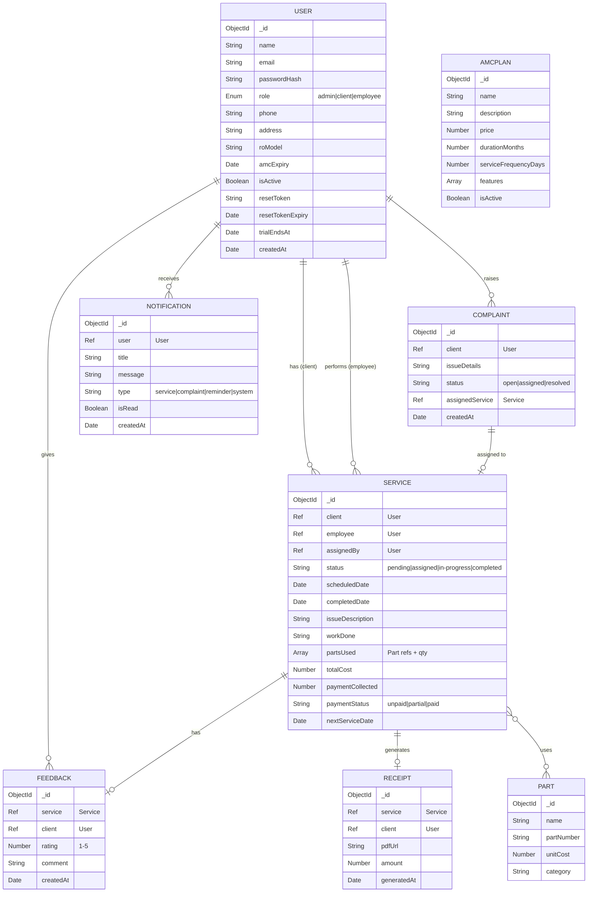
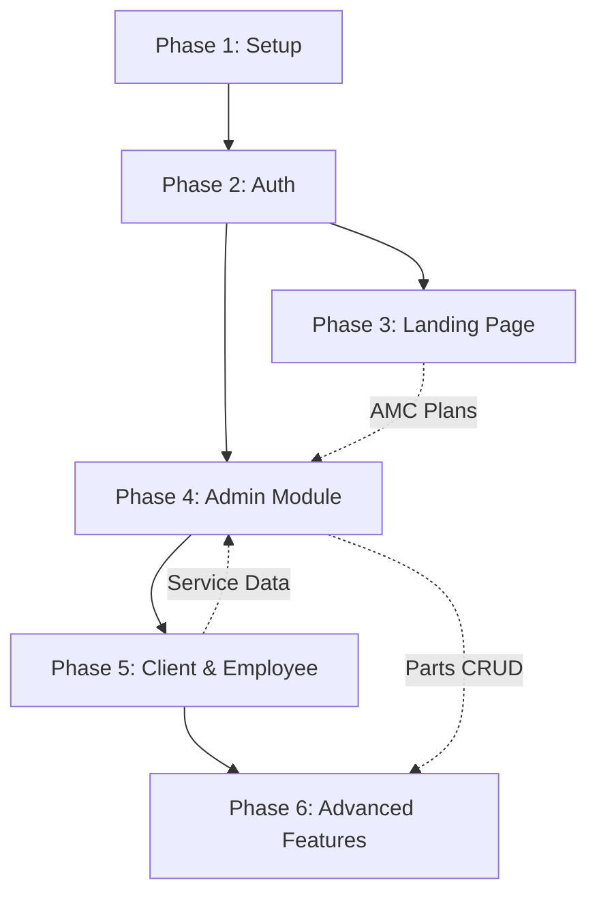

# AquaCare — Full Implementation Plan

## 1. Project Overview

**AquaCare** is a full-stack MERN web application for an RO (Reverse Osmosis) water purifier servicing company. It manages clients, employees, service visits, complaints, AMC plans, receipts, feedback, and notifications across 3 roles: **Admin**, **Client**, and **Employee**.

---

## 2. Tech Stack

| Layer | Technology |
|---|---|
| Frontend | React 18 + Vite |
| Styling | TailwindCSS v3 |
| Charts | Recharts |
| State Mgmt | Zustand (lightweight) |
| Routing | React Router v6 (protected routes) |
| HTTP Client | Axios (with interceptors) |
| Backend | Node.js + Express.js |
| Database | MongoDB + Mongoose |
| Auth | JWT (access + refresh tokens) |
| PDF | PDFKit (server-side) |
| Excel | ExcelJS |
| Email | Nodemailer (SMTP) |
| File Upload | Multer |
| Validation | Joi (backend), Zod (frontend) |
| Scheduler | node-cron (auto-reminders) |
| Testing | Jest + Supertest (API), Vitest (frontend) |

---

## 3. Folder Structure

```
k:\AquaCare\
├── client/                     # React + Vite frontend
│   ├── public/
│   │   └── favicon.ico
│   ├── src/
│   │   ├── assets/             # Images, logos, icons
│   │   ├── components/         # Reusable UI components
│   │   │   ├── ui/             # Button, Input, Modal, Card, Table
│   │   │   ├── layout/         # Navbar, Sidebar, Footer
│   │   │   └── charts/         # Chart wrappers
│   │   ├── pages/
│   │   │   ├── Landing.jsx
│   │   │   ├── Login.jsx
│   │   │   ├── Register.jsx
│   │   │   ├── ForgotPassword.jsx
│   │   │   ├── ResetPassword.jsx
│   │   │   ├── admin/          # Admin dashboard pages
│   │   │   ├── client/         # Client dashboard pages
│   │   │   └── employee/       # Employee dashboard pages
│   │   ├── hooks/              # Custom React hooks
│   │   ├── store/              # Zustand stores
│   │   ├── services/           # Axios API service modules
│   │   ├── utils/              # Helpers, formatters, constants
│   │   ├── guards/             # ProtectedRoute, RoleGuard
│   │   ├── App.jsx
│   │   ├── main.jsx
│   │   └── index.css
│   ├── .env
│   ├── tailwind.config.js
│   ├── vite.config.js
│   └── package.json
│
├── server/                     # Node.js + Express backend
│   ├── src/
│   │   ├── config/             # DB, env, constants
│   │   │   ├── db.js
│   │   │   ├── env.js
│   │   │   └── constants.js
│   │   ├── models/             # Mongoose schemas
│   │   │   ├── User.js
│   │   │   ├── Service.js
│   │   │   ├── Complaint.js
│   │   │   ├── Feedback.js
│   │   │   ├── AMCPlan.js
│   │   │   ├── Notification.js
│   │   │   ├── Part.js
│   │   │   └── Receipt.js
│   │   ├── routes/             # Express route definitions
│   │   │   ├── auth.routes.js
│   │   │   ├── admin.routes.js
│   │   │   ├── client.routes.js
│   │   │   ├── employee.routes.js
│   │   │   ├── service.routes.js
│   │   │   ├── notification.routes.js
│   │   │   └── report.routes.js
│   │   ├── controllers/        # Route handlers
│   │   ├── middlewares/        # Auth, RBAC, validation, rate-limit, error
│   │   │   ├── auth.middleware.js
│   │   │   ├── role.middleware.js
│   │   │   ├── validate.middleware.js
│   │   │   ├── rateLimiter.middleware.js
│   │   │   └── errorHandler.middleware.js
│   │   ├── validators/         # Joi schemas per route
│   │   ├── services/           # Business logic layer
│   │   ├── utils/              # Email, PDF, Excel, helpers
│   │   │   ├── email.util.js
│   │   │   ├── pdf.util.js
│   │   │   ├── excel.util.js
│   │   │   └── token.util.js
│   │   ├── jobs/               # Cron jobs (reminders)
│   │   │   └── serviceReminder.job.js
│   │   └── app.js              # Express app setup
│   ├── server.js               # Entry point
│   ├── .env
│   └── package.json
│
├── prompt.md
├── .gitignore
└── README.md
```

---

## 4. Database Schema Design



---

## 5. OWASP Top 10 Security Plan

| # | Vulnerability | Mitigation |
|---|---|---|
| A01 | **Broken Access Control** | RBAC middleware on every route; server-side role checks; users can only access own data |
| A02 | **Cryptographic Failures** | bcrypt (12 rounds) for passwords; HTTPS enforced; JWT secrets in env vars; no sensitive data in JWT payload |
| A03 | **Injection** | Mongoose parameterized queries (no raw queries); Joi input validation; sanitize-html for text fields |
| A04 | **Insecure Design** | Separation of concerns (controller→service→model); principle of least privilege; rate limiting |
| A05 | **Security Misconfiguration** | Helmet.js for HTTP headers; CORS whitelist; disable `x-powered-by`; env-based config |
| A06 | **Vulnerable Components** | `npm audit` in CI; pin dependency versions; Snyk/Dependabot alerts |
| A07 | **Auth Failures** | Short-lived access tokens (15min) + HTTP-only refresh tokens; account lockout after 5 failed attempts; secure password reset flow |
| A08 | **Data Integrity Failures** | Validate all input server-side; verify JWT signature; CSP headers to block inline scripts |
| A09 | **Logging & Monitoring** | Winston logger; log auth events, errors, admin actions; no sensitive data in logs |
| A10 | **SSRF** | No user-supplied URLs fetched server-side; validate file uploads (type, size) |

### Additional Security Measures
- **Rate Limiting**: `express-rate-limit` — 100 req/15min general, 5 req/15min for login
- **CORS**: Whitelist only the frontend origin
- **Helmet.js**: Secure HTTP headers (CSP, HSTS, X-Frame-Options, etc.)
- **Cookie Security**: `httpOnly`, `secure`, `sameSite: strict` for refresh tokens
- **File Upload**: Multer with file-type validation, max 5MB, rename files
- **Mongo Sanitize**: `express-mongo-sanitize` to prevent NoSQL injection
- **XSS Protection**: `xss-clean` middleware + sanitize user inputs
- **HPP**: `hpp` middleware to prevent HTTP parameter pollution

---

## 6. API Design (Key Endpoints)

### Auth
| Method | Endpoint | Access |
|---|---|---|
| POST | `/api/auth/register` | Public |
| POST | `/api/auth/login` | Public |
| POST | `/api/auth/refresh-token` | Public |
| POST | `/api/auth/forgot-password` | Public |
| POST | `/api/auth/reset-password/:token` | Public |
| POST | `/api/auth/logout` | Authenticated |

### Admin
| Method | Endpoint | Access |
|---|---|---|
| GET | `/api/admin/dashboard` | Admin |
| CRUD | `/api/admin/employees` | Admin |
| CRUD | `/api/admin/clients` | Admin |
| GET | `/api/admin/complaints` | Admin |
| POST | `/api/admin/assign-service` | Admin |
| GET | `/api/admin/reports/:type` | Admin |

### Client
| Method | Endpoint | Access |
|---|---|---|
| GET | `/api/client/dashboard` | Client |
| GET | `/api/client/services` | Client |
| POST | `/api/client/complaints` | Client |
| POST | `/api/client/feedback/:serviceId` | Client |
| GET | `/api/client/receipts/:serviceId` | Client |

### Employee
| Method | Endpoint | Access |
|---|---|---|
| GET | `/api/employee/dashboard` | Employee |
| GET | `/api/employee/services` | Employee |
| PUT | `/api/employee/services/:id/complete` | Employee |
| GET | `/api/employee/stats` | Employee |

### Shared
| Method | Endpoint | Access |
|---|---|---|
| GET | `/api/notifications` | Authenticated |
| PUT | `/api/notifications/:id/read` | Authenticated |
| GET/PUT | `/api/profile` | Authenticated |
| GET | `/api/plans` | Public |

---

## 7. Phased Implementation Plan

### Phase 1 — Project Setup & Foundation (Day 1-2)

**Tasks:**
1. Initialize monorepo structure (`client/` + `server/`)
2. Set up Vite + React + TailwindCSS frontend
3. Set up Express + MongoDB backend with folder structure
4. Configure environment variables (`.env.example`)
5. Install & configure security packages (helmet, cors, rate-limit, mongo-sanitize, hpp)
6. Set up global error handler & Winston logger
7. Create base Mongoose models (User, AMCPlan)
8. Set up ESLint + Prettier for both client/server

**Deliverable:** Runnable skeleton with DB connection, health-check endpoint, and styled landing page shell.

---

### Phase 2 — Authentication & Authorization (Day 3-4)

**Tasks:**
1. Implement User model with bcrypt password hashing
2. Build auth controller: register, login, logout, refresh-token, forgot/reset password
3. JWT access token (15min) + refresh token (7d, HTTP-only cookie)
4. Auth middleware (verify JWT, attach user to `req`)
5. Role middleware factory: `authorize('admin', 'client')`
6. Account lockout after 5 failed login attempts
7. Frontend: Login, Register, Forgot/Reset Password pages
8. Axios interceptor for auto token refresh
9. Zustand auth store + ProtectedRoute guard
10. 14-day free trial logic on registration

**Deliverable:** Complete auth flow with role-based route protection.

---

### Phase 3 — Landing Page & AMC Plans (Day 5-6)

**Tasks:**
1. Design & build landing page (hero, features, AMC plans, testimonials, CTA)
2. AMC Plan model + seed data (Basic, Standard, Premium)
3. Public API to fetch plans
4. Plan comparison cards on landing page
5. "Start Free Trial" → registration flow
6. Responsive design for mobile/tablet
7. Smooth scroll, animations (Framer Motion)

**Deliverable:** Production-quality landing page with AMC plan display.

---

### Phase 4 — Admin Module (Day 7-10)

**Tasks:**
1. **Admin Dashboard**: analytics cards (total clients, employees, pending services, revenue) + Recharts graphs
2. **Employee CRUD**: list with search/filter, add/edit modal, deactivate, pagination
3. **Client CRUD**: list with search/filter, add/edit modal, view AMC details, pagination
4. **Complaint Management**: view all open complaints, assign to employee → creates Service
5. **Service Assignment**: pending services list, assign employee dropdown, notification trigger
6. **Reports Module**: generate PDF/Excel reports (services, payments, feedback) with filters (date range, employee)
7. **Notification Center**: real-time bell icon with unread count, mark-as-read

**Deliverable:** Fully functional admin panel with analytics, CRUD, and reports.

---

### Phase 5 — Client & Employee Modules (Day 11-14)

**Client Module:**
1. Dashboard: profile card, RO model info, AMC expiry countdown, upcoming service
2. Service History: table with status badges, date, employee name
3. Raise Complaint: form with issue description + optional image upload
4. Feedback: star rating + comment form (post-service)
5. Download Receipt: PDF with company logo, service details, cost breakdown

**Employee Module:**
1. Dashboard: today's assigned services, monthly calendar view, stats cards
2. Service Visit Form: issue description, work done, parts used (dropdown from Parts table), cost, payment collected
3. Submit Service → auto-generates receipt PDF, notifies client + admin
4. Statistics: services completed, average rating, parts used
5. Profile page with edit capability

**Deliverable:** Both client and employee dashboards fully operational.

---

### Phase 6 — Advanced Features & Polish (Day 15-18)

**Tasks:**
1. **Auto-Reminders**: node-cron job runs daily, checks `nextServiceDate`, sends email via Nodemailer
2. **Parts Table**: CRUD for admin, dropdown for employees during service
3. **Notification System**: in-app notifications + email for critical events
4. **PDF Receipts**: PDFKit templates with company logo, service details, payment breakdown
5. **Excel Reports**: ExcelJS with formatted sheets, charts-ready data
6. **Performance**: React.lazy() for code splitting, MongoDB indexes, API response compression
7. **Final Security Audit**: OWASP checklist review, npm audit, test all RBAC paths
8. **Deployment Prep**: production build, environment configs, PM2 setup

**Deliverable:** Production-ready application with all features.

---

## 8. Module Dependency Map



---

## 9. Key Design Decisions

| Decision | Rationale |
|---|---|
| **Zustand over Redux** | Simpler API, less boilerplate, sufficient for this app's complexity |
| **Joi over Zod (backend)** | More mature Express ecosystem integration, better error messages |
| **PDFKit over Puppeteer** | Lighter, no headless browser needed, faster PDF generation |
| **node-cron over Bull** | No Redis needed for simple scheduled tasks |
| **Access + Refresh tokens** | Balances security (short-lived access) with UX (no frequent re-login) |
| **Server-side PDF generation** | Consistent output, no client-side dependency, secure |
| **Monorepo (no workspaces)** | Simple structure, easy to understand, no tooling overhead |

---

## 10. Environment Variables

### Server `.env`
```
NODE_ENV=development
PORT=5000
MONGODB_URI=mongodb://localhost:27017/aquacare
JWT_ACCESS_SECRET=<random-64-char>
JWT_REFRESH_SECRET=<random-64-char>
JWT_ACCESS_EXPIRY=15m
JWT_REFRESH_EXPIRY=7d
SMTP_HOST=smtp.gmail.com
SMTP_PORT=587
SMTP_USER=your-email@gmail.com
SMTP_PASS=app-password
CLIENT_URL=http://localhost:5173
```

### Client `.env`
```
VITE_API_URL=http://localhost:5000/api
VITE_APP_NAME=AquaCare
```

---

> [!IMPORTANT]
> **Awaiting your feedback** before I start building. Please review and confirm:
> 1. Is the tech stack acceptable? (Zustand vs Redux, etc.)
> 2. Any features to add/remove/prioritize?
> 3. Should I start with Phase 1 immediately?
> 4. Do you have MongoDB installed locally, or should I plan for MongoDB Atlas?
